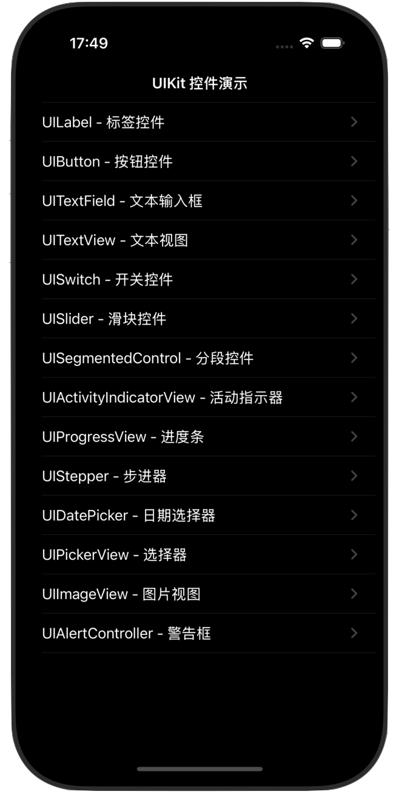

# UIKitControlsDemo

一个使用纯代码 UIKit 编写的控件演示应用，展示了 iOS 开发中常用的 UIKit 控件及其用法。


## 效果预览



## 功能特点

- 🎯 **纯代码实现**：完全使用 Swift 代码构建 UI，无 Storyboard 或 XIB
- 📱 **完整演示**：涵盖 14 个常用 UIKit 控件
- 🎨 **交互式体验**：所有控件都可实际操作和体验
- 🚀 **模块化设计**：代码结构清晰，易于学习和扩展
- 📖 **详细注释**：代码中包含详细的中文注释说明

## 支持的控件

| 控件                    | 功能描述         | 状态 |
| ----------------------- | ---------------- | ---- |
| UILabel                 | 文本标签显示     | ✅    |
| UIButton                | 按钮交互         | ✅    |
| UITextField             | 文本输入框       | ✅    |
| UITextView              | 多行文本视图     | ✅    |
| UISwitch                | 开关控件         | ✅    |
| UISlider                | 滑块控件         | ✅    |
| UISegmentedControl      | 分段选择器       | ✅    |
| UIActivityIndicatorView | 活动指示器       | ✅    |
| UIProgressView          | 进度条           | ✅    |
| UIStepper               | 步进器           | ✅    |
| UIDatePicker            | 日期选择器       | ✅    |
| UIPickerView            | 自定义选择器     | ✅    |
| UIImageView             | 图片显示         | ✅    |
| UIAlertController       | 警告框和操作菜单 | ✅    |

## 项目结构

```
UIKitControlsDemo/
├── AppDelegate.swift          # 应用入口和窗口设置
├── ViewController.swift        # 主列表页面
├── ControlDetailViewController.swift # 控件详情页面
├── Assets.xcassets        # 应用图标和图片资源
└── Info.plist            # 应用配置信息
```

## 运行要求

- **iOS 版本**: 13.0+
- **Xcode 版本**: 12.0+
- **Swift 版本**: 5.0+
- **设备**: 支持 iPhone 和 iPad

## 安装和运行

1. **克隆项目**
```bash
git clone https://github.com/wumacms/UIKitControlsDemo.git
cd UIKitControlsDemo
```

2. **打开项目**
   - 双击 `UIKitControlsDemo.xcodeproj` 在 Xcode 中打开项目

3. **选择设备**
   - 在 Xcode 顶部选择模拟器或连接的 iOS 设备

4. **编译运行**
   - 按下 `Cmd + R` 或点击运行按钮

## 使用方法

1. **主界面**: 应用启动后显示所有支持的 UIKit 控件列表
2. **详情页面**: 点击列表项进入对应控件的详细演示页面
3. **交互体验**: 在详情页面中可以实际操作和体验控件功能
4. **返回**: 使用导航栏返回按钮或边缘滑动返回主界面

## 代码示例

### 主列表页面实现
```swift
class ViewController: UIViewController {
    private let tableView = UITableView()
    
    override func viewDidLoad() {
        super.viewDidLoad()
        setupUI()
    }
    
    private func setupUI() {
        title = "UIKit 控件演示"
        // 表格视图设置...
    }
}
```

### 控件详情页面
```swift
class ControlDetailViewController: UIViewController {
    private let controlType: ControlType
    private let scrollView = UIScrollView()
    
    init(controlType: ControlType) {
        self.controlType = controlType
        super.init(nibName: nil, bundle: nil)
    }
    
    private func setupControlDemo() {
        switch controlType {
        case .button:
            setupButtonDemo()
        case .switchControl:
            setupSwitchDemo()
        // 其他控件...
        }
    }
}
```

## 核心特性

### 纯代码布局
- 使用 `frame` 布局和 `autoresizingMask`
- 支持设备旋转和不同屏幕尺寸
- 清晰的视图层级结构

### 交互处理
- Target-Action 模式处理用户交互
- Delegate 模式处理复杂控件
- 手势识别支持

### 导航结构
- UINavigationController 管理页面导航
- 清晰的页面跳转关系
- 支持滑动返回

## 学习价值

这个项目非常适合以下人群：

- 🔰 **iOS 开发初学者**：学习 UIKit 基础控件的使用方法
- 📚 **Swift 学习者**：了解纯代码布局的最佳实践
- 🎓 **面试准备者**：掌握常见控件的特性和使用场景
- 🔧 **项目参考**：作为新项目的起点或代码参考

## 贡献

欢迎提交 Issue 和 Pull Request 来改进这个项目！

1. Fork 本项目
2. 创建特性分支 (`git checkout -b feature/AmazingFeature`)
3. 提交更改 (`git commit -m 'Add some AmazingFeature'`)
4. 推送到分支 (`git push origin feature/AmazingFeature`)
5. 开启 Pull Request

## 许可证

本项目采用 MIT 许可证 - 查看 [LICENSE](LICENSE) 文件了解详情。

## 更新日志

### v1.0.0
- 初始版本发布
- 支持 14 个 UIKit 控件演示
- 纯代码实现，无 Storyboard

## 联系方式

如有问题或建议，请通过以下方式联系：

- 提交 [Issue](https://github.com/wumacms/UIKitControlsDemo/issues)
- 微信交流：lumadada

---

⭐ 如果这个项目对你有帮助，请给它一个 Star！